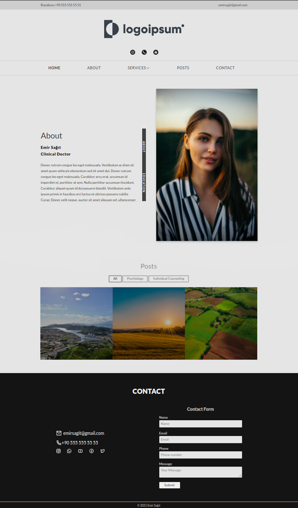

# A Next.js website using Netlify CMS for posts section.



## Built With

- Next.js, TypeScript, JavaScript, CSS, HTML, NetlifyCMS

## Features

- **Tagging**: organizes posts by tags
- **Filtering**: instantly filtering posts by tag
- **Custom Scroll Bar**: About section has a custom titled scrollbar which shows where you're while reading and by clicking it you can scroll to content.
- **Pagination**: limits the number of posts per page
- **CMS**: built with Netlify CMS to allow editors to modify content
- **Custom design**: Custom design pages created with pure CSS.

## Requirements

- First of all, I created this project for a psychologist. Requirements are:
- Black and white-colored desing.
- Custom scrollbar.
- Instant filtering posts with tags like a webpage she showed me.
- Fast web application whose pages will instantly load.
- Author can edit and create the posts
- Seo optimized website

## Live website

- [Live Website](https://www.caglasenol.com/)

## Dependencies

- [TypeScript](https://www.typescriptlang.org/)
- [Next.js](https://nextjs.org/)
- [Netlify](https://www.netlify.com/)
- [MDX](https://mdxjs.com/)

## Getting started

- To create your app first clone it. Then open your terminal, `cd` into the directory you'd like to create the app in, and run the following command:

```
npm run dev
```

- If you want to use it on Netlify CMS follow this instructions on Netlify

- [Netlify CMS for Next.js](https://www.netlifycms.org/docs/nextjs/)

## Customization and Thanks

- I've customize [Next.js blog template for Netlify](https://github.com/wutali/nextjs-netlify-blog-template) boilerplate template. Thanks for creating this beautiful boilerplate.
- Demo images taken from [Unsplash](https://unsplash.com/)

## 🤝 Contributing

Contributions, issues, and feature requests are welcome!

Feel free to check the [issues page](../../issues/).

## Show your support

Give a ⭐️ if you like this project!

## 📝 License

This project is [MIT](./MIT.md) licensed.
